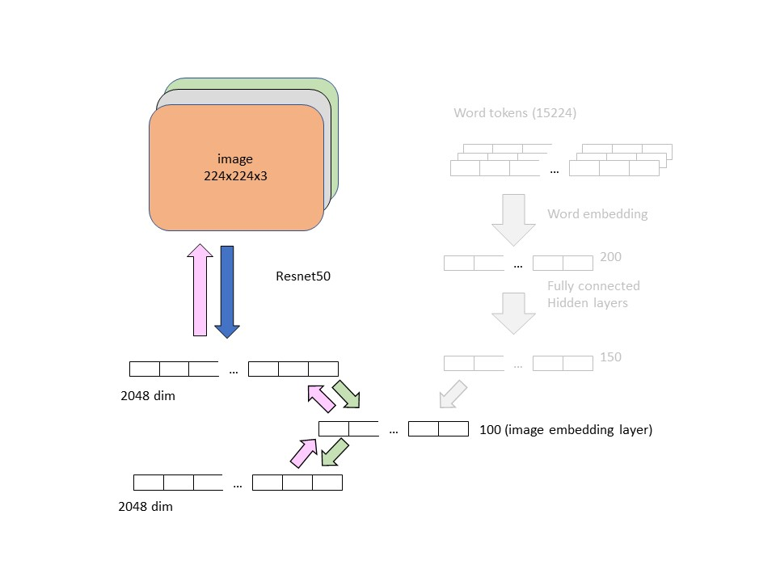
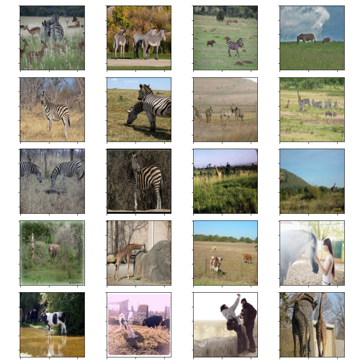

# Image retrieval

## Challenge

build an algorithm for content-based image retrieval. This is a nice problem that requires both computer vision and NLP techniques. The dataset is hosted on Kaggle competition here https://www.kaggle.com/c/cs5785-fall19-final/data.

## Work update

The previous work was done around early Jan 2020. I uploaded this work in Jupyter notebook. In summary, the work mainly consists of word2vec embedding, and TFIDF text vectorization strategy. This is a more traditional machine learning, text mining type of work. The retrieval accuracy is very good for the small set of data. However, I was thinking about how to incorporate deep learning into it. So below here is the update. 

---

## image & text embedding

### strategy
The strategy here is to use convolutional neural network to perform embedding of the images and use word embedding + neural network to do word embedding. The key is that both the images and the words are embedded in the same high dimensional space where the text information and similar image information are mapped to nearby location in this space. With this shared embedding space, we can use nearest neighbor technique to retrieve the neighbors.

 
<b>Figure 1.</b> image and text embedding with nearest neighbors. the text query is represented as a star in the embedding space. The nearest image neighbors are shown as circled of the same color wihtin the neighborhood (boundary). 

## image embedding by autoencoder

I use  resnet-50 to perform image embedding via autoencoder. I map the 2048 last convolution layer to the encoded layer of 100 dimensions. Then from 100 dimensions encoded layer, I decode it back to 2048 layer. The objective function is simply root-mean-square error. Theoretically, if we have enough data, we don't need to do this step at all, and can just embed the image onto the 2048 dimensional space. But since the dataset is quite limited, using spae of 2048 will give you too sparse embedding, and won't be useful later when we do nearest neighobors. Doing autoencoder step here is akin to doing dimensionality reduction.

 
<b>Figure 2.</b> image autoencoder. The backward arrows represent the backward gradient propagation. 

## text embedding

Initially, I was thinking about using BERT to do embedding, and map the resnet to BERT final 768-dimensional layer. But soon I realize that the dataset won't be enough to do this effectively. The idea is that if our sampling of the hidden layer is too sparse, then we won't be able to place similar content near each other. So the nearest neighbors will not work. 

So I decided to not use BERT but instead do word embedding myself. Then map the output to 100 dimension image encoded layer. The objective function I used is root-mean-square error. I also try [triplet loss](https://en.wikipedia.org/wiki/Triplet_loss) which is a distance comparison between the correct pair and the false pair. I get about the same result.

 
<b>Figure 3.</b> word embedding. Word tokens are embedded and passed through hidden layer before being mapped to the layers shared with the images. The backward arrows represent the backward gradient propagation. 

## Training and Result

I split the dataset into 9000 training sample and 1000 test sample. Afer the training for 15 epochs, I can retrieve about 65% of images within first top 20 result query (i.e. nearest neighbors with k = 20). This is comparable to the machine learning approach I did in Jan-2020, but this deep learning approach may scale up better if we can get more data.

---

## Visualization

Here are some of the query results 

<b>Figure 4.</b> black cat standing on a couch thats in a cluttered room
 

<b>Figure 5.</b> Zebras grazing in the tall grass of a light woodland
 

<b>Figure 6.</b> A group of guys playing a video game together
 

---